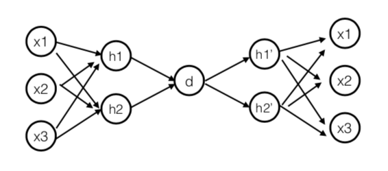

***

# Network-Anomaly-Detection

This project aims to provide a setup for anomaly detection in Networking, specifically to detect DDoS attacks

<summary>Table of Contents</summary>

- [Network-Anomaly-Detection](#Network-Anomaly-Detection)
  - [Introduction:](#Introduction)
  - [Dependencies:](#dependencies)
  - [Setup Instructions](#setup-instructions)
  - [Train Dataset](#Train-Dataset:)
  - [Results](#results)
  - [Visualizing Data with TSNE:](#Visualizing-Data-Relationship-with-TSNE)
  - [Future Work](#future-work)


## Introduction


Many IoT devices are becoming victims of hackers due to their lack of security and they are often turned into botnets conducting Distributed Denial of Service (DDoS) attacks. We aim to detect those attacks by analyzing their network traffic. 

When designing the model, one has to keep in mind that in a real life scenario, the attack detection is relevant only if it is conducted in a streaming/near real time way.

We will create an autoencoder model in which we only show the model non-fraud cases. The model will try to learn the best representation of normal cases. The same model will be used to generate the representations of cases where a DDoS attack is done, and we expect them to be different from normal ones.

Create a network with one input layer and one output layer having identical dimentions ie. the shape of non-fraud cases. We will use keras package to craete our model.

 

The beauty of this approach is that we do not need too many samples of data for learning the good representations. We will use only 8000 rows of normal cases to train the autoencoder. Additionally, We do not need to run this model for a large number of epochs, running it for 10 epochs was sufficient.

Explanation: The choice of small samples from the original dataset is based on the intuition that one class characteristics (normal) will differ from that of the other (DDoS-attack). To distinguish these characteristics we need to show the autoencoders only one class of data. This is because the autoencoder will try to learn only one class and automaticlly distinuish the other class.

Once, the model is trained. We are intereseted in obtaining latent representation of the input learned by the model. This can be accessed by the weights of the trained model. We will create another network containing sequential layers, and we will only add the trained weights till the third layer where latent representation exists. Generate the hidden representations of two classes : normal and DDoS-Attack by predicting the raw inputs using the above model.

Now, we can just train a simple linear classifier on the dataset. Or we can choose to train a multi-class clasifier, which can be another NN with softmax outputs for the number of classes!


## Traditional Machine Learning-Based Approaches

Below is a brief overview of popular machine learning-based techniques for anomaly detection.

<b> a.Density-Based Anomaly Detection </b>
Density-based anomaly detection is based on the k-nearest neighbors algorithm.

Assumption: Normal data points occur around a dense neighborhood and abnormalities are far away.

The nearest set of data points are evaluated using a score, which could be Eucledian distance or a similar measure dependent on the type of the data (categorical or numerical). They could be broadly classified into two algorithms:

K-nearest neighbor: k-NN is a simple, non-parametric lazy learning technique used to classify data based on similarities in distance metrics such as Eucledian, Manhattan, Minkowski, or Hamming distance.

Relative density of data: This is better known as local outlier factor (LOF). This concept is based on a distance metric called reachability distance.

<b> b.Clustering-Based Anomaly Detection </b>
Clustering is one of the most popular concepts in the domain of unsupervised learning.

Assumption: Data points that are similar tend to belong to similar groups or clusters, as determined by their distance from local centroids.

K-means is a widely used clustering algorithm. It creates 'k' similar clusters of data points. Data instances that fall outside of these groups could potentially be marked as anomalies.

<b>c.Support Vector Machine-Based Anomaly Detection </b>
A support vector machine is another effective technique for detecting anomalies.
A SVM is typically associated with supervised learning, but there are extensions (OneClassCVM, for instance) that can be used to identify anomalies as an unsupervised problems (in which training data are not labeled).
The algorithm learns a soft boundary in order to cluster the normal data instances using the training set, and then, using the testing instance, it tunes itself to identify the abnormalities that fall outside the learned region.

In this project we are going to test the following Anomaly Detection Techniques namely

- Isolation Forest Anomaly Detection Algorithm

- Density-Based Anomaly Detection (Local Outlier Factor)Algorithm

- Support Vector Machine Anomaly Detection Algorithm

- <b>AutoEncoders for AnomalyDetection</b>


## Results

The below result was acheived with AutoEncoder method  


## Setup Instructions:
#### 1. Requirements

To reproduce the results from this repository, it is recommended to use virtual python environment and python version 3.6 Tensorflow version 2.3 was used to build the models. The project is tested only on Linux

Follow these simple steps to setup the dependencies:

```shell
git clone https://github.com/AkhilSinghRana/Network-Anomaly-Detection.git

cd Network-Anomaly-Detection/ 

virtualenv env_name -p python3

source env_name/bin/activate #for linux


pip install -e .

 ```

Note*- The above code will setup all the required dependencies for you. Tested only on Linux


You are now ready to train the models. I recommend to also browse through notebooks folder to understand the workflow a bit better.

## 2. Data-Exploration:

It is very important to understand the data before the model is constructed. You can go through the notbook DataExploration inside notebooks folder to check how the exploration was done and how data looks like.

Some highlights from the notebook and how data exploration can benefit you in model creation is shown below.

|Request Packet sent according to classes | Correlation matrix|
|----------------|------------|
| | |


## Train Dataset:

Instructions for training on your own Dataset is shown in the notebook below. 

Jupyter Notebook:

``` jupyter notebook notebooks/Model_Training.ipynb  ```
 
Running from a Terminal:

``` python main.py --help ```

Sample training command, I assume that the csv files are stored inside data folder of the root project directory & the command is run from root_dir

```shell

python main.py --data_path data/data.csv --mode train


```
         
  
## Testing/Loading-checkpoints:

Sample test command from root_dir 

```shell

python main.py --data_path data/test.csv --mode test

```

The above test command will take the test csv and pass through the autoencoder for creating latent representation of the test data, which then be passed through to the trained linear regression classifier
         
## Visualizing Data Relationship with TSNE:

T-SNE (t-Distributed Stochastic Neighbor Embedding) is a dataset decomposition technique which reduced the dimentions of data and produces only top n components with maximum information.

Every dot in the following represents a request. Normal transactions are represented as Green while potential attacks are represented as Red. The two axis are the components extracted by tsne.

|TSNE on Normal scaled data vs | TSNE on embedded Latent representation|
|----------------|------------|
| | |


## Future Work

- Adding and training more models

- further classifying different kinds of DDoS attacks!

- Creating a semi-supervised loop to update models online while new data is being gathered.
